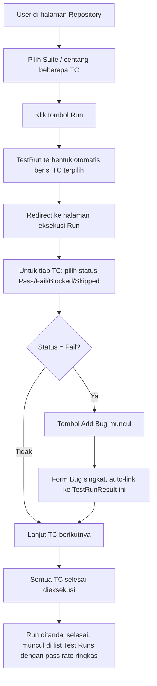
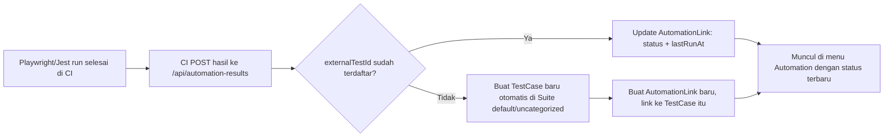

# PRD: Soul Testcase Management
**SoulParking QA Team**
Status: Draft v0.3

> **Changelog dari v0.1:**
> - Section 4: hierarki Modul/Submodul diganti model Folder rekursif (self-referencing tree), Platform & Project tetap sebagai anchor tetap
> - Section 5: entity `Module`/`Submodule` digabung jadi `Folder`; `AutomationLink` ditambah field `externalTestId` (unik) untuk mendukung upsert dari hasil CI; `TestRunResult` ditambah `titleSnapshot`
> - Section 6.1: CRUD hierarki disesuaikan ke Folder rekursif
> - Section 6.2: flow Test Run disederhanakan ala Qase (Express Run) — tidak ada entitas Test Plan terpisah untuk v1
> - Section 6.4: traceability requirement/PRD memakai global search (tsvector) + mention `@TC-ID`, bukan entitas `Requirement` baru
> - Section 9: poin 1, 2, 3 (definisi Platform, reusability, kedalaman hierarki) resolved — lihat catatan di section tersebut
> - Section 11 (baru): struktur menu/navigasi aplikasi
> - Step 1, 2, 3, 4, 6 di rencana pengerjaan: AI command disesuaikan ke skema baru
> - Section 1: revisi latar belakang — tool yang dipakai saat ini adalah ClickUp (bukan CSV/XLSX/docx), dengan pain point konkret ditambahkan (reuse TC tidak proper, coverage sulit dihitung)
> - Section 12 (baru): UI/UX & flow utama — layout kasar tiap layar kunci, flow diagram (Express Run, Automation upsert dari CI, Bug dari eksekusi), prinsip UI umum lintas layar
> - Section 0 (baru): terminologi — label dokumen/UI diubah ke gaya Qase (Project, Suite); **direvisi lagi**: karena rencana pindah ke server kantor (bukan cuma MVP lokal lagi), struktur teknis ikut disatukan — `Platform` di-rename jadi `Project`, dan `Project`+`Folder` lama digabung jadi satu tabel `Suite` rekursif. Nama teknis dan label dokumen sekarang identik. Lihat Step 3.5 (Section 10) untuk migrasi data dari skema lama.

---

## 0. Terminologi

Struktur final (skema = label dokumen, tidak ada lagi perbedaan seperti draft sebelumnya):

- **Project** — top-level, representasi produk/aplikasi berbeda. *(sebelumnya bernama teknis `Platform`)*
- **Suite** — rekursif (self-referencing), berada di dalam 1 Project, bisa nested tanpa batas kedalaman. *(sebelumnya 2 tabel terpisah: `Project` lama + `Folder`, sekarang digabung jadi 1 tabel `Suite`)*
- **Test Case** — tidak berubah.

> Riwayat: draft v0.2 sempat mempertahankan 2 tabel teknis terpisah (`Project`+`Folder`) dengan alasan menghindari migrasi karena masih tahap MVP lokal. Begitu ada rencana pindah ke server kantor, penyatuan ini justru lebih murah dilakukan sekarang (baru Step 1-3 yang terdampak) dibanding setelah Step 4+ (Test Run, Automation) menambah lebih banyak foreign key yang bergantung pada struktur lama.

## 1. Latar Belakang

QA team SoulParking saat ini mengelola test case menggunakan **ClickUp** untuk berbagai fitur produk (Officer App, Web Admin, dsb), dengan konvensi penamaan dan struktur (Module → Suite → Sub-suite) yang sudah cukup matang secara konsep, tapi ClickUp sendiri tidak didesain untuk kebutuhan test case management sehingga muncul beberapa kendala nyata:

- **Reuse TC tidak proper**: ClickUp tidak punya konsep "jalankan ulang TC yang sama di run/enhancement baru" secara native. Saat ini diakali dengan menambahkan TC yang sama ke *activity log* task terkait — bukan mekanisme yang didesain untuk ini, sehingga histori eksekusi jadi tidak terstruktur dan sulit ditelusuri lintas run.
- **Coverage sulit dihitung**: karena tidak ada struktur eksekusi yang konsisten (lihat poin di atas), menghitung persentase TC yang sudah tercakup automation maupun coverage per fitur jadi sulit dilakukan secara akurat dari data yang ada di ClickUp.

Automation testing (Playwright/Jest/TypeScript) juga berjalan terpisah dari dokumentasi manual TC di ClickUp, dan tidak ada koneksi eksplisit antara TC manual, automation script, dan bug findings.

## 2. Tujuan (Goals)

Membangun internal tool untuk test case management dengan tiga prioritas utama:

1. **Visibility** — status TC, hasil eksekusi, dan bug terkait harus mudah dilihat tanpa perlu buka banyak file/tools terpisah.
2. **Kemudahan penggunaan** — workflow membuat, mengorganisir, dan menjalankan TC harus lebih cepat dibanding proses manual saat ini.
3. **Koneksi/traceability antar entitas** — TC manual harus terhubung eksplisit dengan automation script dan bug findings, bukan disimpan sebagai data terpisah.

## 3. Target Pengguna

- **QA** — full access: create/edit/execute TC, kelola hierarki, kelola Bug, review automation status.
- **Developer** — view TC & Bug, update status `AutomationLink`, update/resolve status Bug.
- **Product** — view-only dashboard/coverage, bisa comment di Test Case.

## 4. Struktur Hierarki

```
Project → Suite (nested, kedalaman bebas) → Test Case
```

- **Project**: representasi produk/aplikasi berbeda (Officer App, Web Admin, Customer App, dst). Dapat dibuat baru sesuai kebutuhan.
- **Suite**: berada di dalam 1 Project, bersifat **rekursif** (self-referencing — Suite bisa punya sub-Suite tanpa batas kedalaman). Kode unik per level Suite yang sama (siblings).
- **Test Case**: berada di dalam 1 Suite (leaf atau level mana pun), TC ID auto-generate dari kombinasi kode (format: `{Project}-{suite1.code}-{suite2.code}-...-{sequence}`, mengikuti path dari root Project sampai Suite tempat TC berada), tetap bisa di-override manual.

> **Kenapa berubah dari fixed Modul/Submodul:** hierarki fixed-depth memaksa fitur yang butuh lebih dari 2 level (mis. filter modal dengan banyak section) untuk dipaksakan masuk level yang ada, atau butuh migrasi skema tiap kali ada kasus lebih dalam. Model rekursif (dipakai TestRail via nested Section, dan Qase via nested Suite) menghindari ini — kedalaman menyesuaikan kebutuhan tiap fitur tanpa perubahan skema.

## 5. Entity Relationship Diagram

Entitas utama: `Project` (top-level, dulu `Platform`), `Suite` (rekursif, self-referencing — gabungan tabel `Project` lama + `Folder`), `TestCase`, `AutomationLink`, `TestRun`, `TestRunResult`, `Bug`, `Attachment`, `User`.

Poin desain penting:
- `Suite` self-referencing (`parentId` nullable, relasi ke dirinya sendiri) dan punya `projectId` (FK ke `Project`) — Suite level pertama (`parentId = null`) langsung anak dari Project, nested Suite di bawahnya bebas bertambah.
- `Attachment` terhubung ke **dua konteks berbeda**: referensi di level TestCase (expected result) vs evidence di level TestRunResult (actual result/bug evidence) — tidak dicampur jadi satu.
- `Bug` bisa terhubung ke TestRunResult spesifik (ditemukan saat 1x run) maupun ke TestCase secara umum (relevan untuk regresi berulang).
- `AutomationLink` bersifat 1-ke-1 dengan TestCase, menyimpan status otomasi, path file script, hasil run CI terakhir, dan field `externalTestId` (unik) — dipakai untuk `upsert` dari hasil eksekusi CI: kalau `externalTestId` belum ada TestCase-nya di repository, TestCase dibuat otomatis; kalau sudah ada, statusnya di-update.
- `TestRunResult` menyimpan `titleSnapshot` (salinan title TestCase pada saat Run dibuat) — memastikan histori eksekusi tetap akurat meski title TestCase master diedit belakangan. Snapshot dibatasi ke field yang paling sering berubah dan paling penting untuk audit (title), bukan snapshot seluruh field TC, supaya skema tetap ringan.
- Tidak ada entitas `TestPlan` terpisah di v1 — `TestRun` dibuat langsung dari pemilihan Suite/TestCase individual (lihat Section 6.2).
- Tidak ada entitas `Requirement` terpisah — traceability ke PRD/acceptance criteria memakai global search + mention `@TC-ID` (lihat Section 6.4).

## 6. Fitur

### 6.1 Test Case Management (Core)
- CRUD Project / Suite (nested, drag-drop reorder dan drag-drop reparent antar Suite)
- CRUD Test Case dengan field: Title, Detail Skenario, Precondition, Steps, Test Data, Expected Result, Priority, Status
- TC ID auto-generate dari path Suite, dengan opsi override manual
- Import/export CSV & XLSX (kompatibel dengan format kerja QA saat ini)

### 6.2 Test Execution & Tracking
- **Express Run**: pilih Suite atau Test Case individual langsung dari Repository, klik "Run" → Test Run terbentuk seketika berisi TC terpilih. Ditujukan untuk eksekusi cepat/ad-hoc (mis. verifikasi hotfix).
- Update status eksekusi per TC dalam suatu Run (Pass/Fail/Blocked/Skipped), actual result & notes
- `titleSnapshot` disimpan otomatis saat Run dibuat
- Histori eksekusi per TC lintas Run (query dari `TestRunResult` berdasarkan `testCaseId`)
- *(Fase lanjutan, di luar scope v1)*: Test Plan sebagai grouping multi-Run untuk regression cycle terjadwal/multi-config

### 6.3 Attachment (Reference & Evidence)
- Upload foto/video sebagai reference di level TC, atau evidence di level hasil eksekusi
- Storage via Google Drive API (Shared Drive), dengan lapisan storage-agnostic agar bisa migrasi ke S3 tanpa ubah skema data

### 6.4 Koneksi & Traceability
- Link TC manual ↔ automation script: via `AutomationLink.externalTestId`, mendukung **auto-create TestCase** saat hasil eksekusi otomatis (CI) di-push ke endpoint hasil dan `externalTestId`-nya belum terdaftar
- Link TC / hasil eksekusi ↔ Bug (internal atau referensi ke Jira/GitHub Issues)
- Halaman detail TC dengan tab: Detail, Automation, Run History, Bugs, Attachments — sebagai single source of truth per TC
- Global search lintas entitas (TC, Bug, automation file) menggunakan Postgres full-text search (tsvector) — dipakai juga sebagai mekanisme utama traceability ke PRD/acceptance criteria (bukan entitas Requirement terpisah)
- Quick-link/mention (`@TC-ID`) saat menulis deskripsi bug

### 6.5 Reporting & Dashboard
- Dashboard: total TC, coverage %, pass rate, TC per Suite
- Coverage matrix: Suite vs proporsi automated vs manual-only
- Bug heatmap per Suite (area yang paling banyak bug)
- Deteksi TC stale/flaky (automated tapi sering gagal atau lama tidak di-run)

### 6.6 Kolaborasi & Governance
- Role: QA, Developer, Product (lihat Section 3 untuk detail akses)
- Auth via Google OAuth, dibatasi domain `@soulparking.co.id`
- Review/approval workflow untuk TC baru *(opsional, fase lanjutan — lihat Section 9 poin 7)*
- Activity log per TC (siapa mengubah apa, kapan)

## 7. Tech Stack

| Layer | Pilihan |
|---|---|
| Framework | Next.js (TypeScript, full-stack) |
| Database | PostgreSQL — Supabase atau Neon (free tier) |
| ORM | Prisma |
| Hosting | Vercel (free/Hobby tier) |
| Auth | NextAuth.js (Auth.js) + Google OAuth, restricted domain |
| Attachment storage | Google Drive API (Shared Drive, domain `@soulparking.co.id`) |

**Catatan arsitektur penting:**
- Vercel Hobby tier membatasi ukuran request body (~4.5MB) dan waktu eksekusi function (~10 detik) → upload video **harus** langsung dari client ke Google Drive, backend hanya menyimpan metadata.
- Supabase free tier (500MB database) diperkirakan cukup untuk puluhan ribu test case (estimasi ~2–5KB per TC row), karena attachment tidak disimpan di database.
- Supabase free tier project auto-pause setelah ~1 minggu tanpa aktivitas — perlu diantisipasi kalau ada periode penggunaan sepi.
- Model Suite rekursif dan alur Express Run dipilih (dibanding meniru penuh TestRail dengan Test Plan berlapis) karena lebih ringan diimplementasikan solo dan lebih cocok dengan limit function timeout Vercel Hobby tier.

## 8. Out of Scope (Fase Awal)

- Migrasi ke S3 (disiapkan arsitekturnya, tidak diimplementasi di fase awal)
- Integrasi otomatis dua arah dengan Jira (fase awal cukup simpan link/reference manual)
- Notifikasi real-time (email/Slack)
- Mobile app khusus (web-responsive dulu)
- Entitas Test Plan terpisah (grouping multi-Run) — v1 cukup Express Run per Suite/TC
- Entitas Requirement terpisah — traceability ke PRD cukup lewat search + mention

## 9. Yang Masih Perlu Didefinisikan

1. ~~Definisi "Project" secara presisi~~ — **Resolved**: Project = produk/aplikasi berbeda (Officer App, Web Admin, Customer App), bukan environment/device. Berdasarkan pola histori kerja QA yang sudah memisahkan TC per aplikasi tanpa ekspektasi struktur Suite yang sama dipakai ulang lintas aplikasi.
2. ~~Reusability Suite lintas Project~~ — **Resolved**: tidak diperlukan, karena Project dianggap dunia/struktur Suite yang independen (mengikuti resolusi poin 1).
3. ~~Kedalaman hierarki~~ — **Resolved**: diganti model Suite rekursif (Section 4), sehingga kedalaman tidak perlu diputuskan di awal — menyesuaikan kebutuhan tiap fitur secara alami.
4. **Reusable Test Data** — Apakah Test Data tetap sebagai free text per TC, atau dipisah jadi entity `TestDataBlock` reusable yang bisa dipakai lintas TC?
5. **Konfirmasi Google Workspace** — Perlu koordinasi dengan admin IT untuk: enable Google Drive API, buat Service Account, setup Shared Drive, dan invite Service Account ke Shared Drive tersebut.
6. **Bug tracking — internal penuh atau hybrid?** — Apakah Bug dicatat penuh di dalam tool ini (`source: INTERNAL`), atau tim sudah pakai Jira/tracker lain dan tool ini hanya menyimpan referensi/link keluar? Ini menentukan seberapa detail field `Bug` perlu dibangun.
7. **Approval/review workflow** — Apakah TC baru butuh approval dari QA sebelum berstatus "Active", atau semua QA punya akses langsung publish?
8. **Notification & reminder** — Di luar scope fase awal, tapi perlu dipikirkan: apakah nanti butuh reminder untuk TC yang lama tidak di-run, atau automation yang flaky berturut-turut?
9. **Retensi attachment** — Berapa lama evidence (foto/video) disimpan sebelum di-archive/dihapus? Relevan untuk kontrol kuota Google Drive ke depan.
10. **Definisi role secara detail** — Batasan akses konkret: siapa yang bisa hapus TC, ubah struktur Project/Suite, atau approve TC baru (kalau poin 7 diaktifkan). Role dasar (QA/Developer/Product) sudah diputuskan di Section 3, ini tinggal detail permission per aksi.

## 10. Rencana Pengerjaan Bertahap

Dipecah jadi 8 step, urutan mengikuti dependency (fondasi dulu, baru fitur yang butuh fondasi itu). Setiap step disertai **AI command** — prompt siap pakai untuk diberikan ke AI coding assistant (mis. Claude Code) saat mengerjakan step tersebut.

> **Catatan:** Step 1–3 di bawah adalah rencana ASLI (skema lama: `Platform`/`Project`/`Folder` terpisah) — ini sudah kamu implementasikan. Karena rencana pindah ke server kantor, struktur disatukan jadi `Project`/`Suite` (lihat Section 0). **Kerjakan Step 3.5 dulu sebelum lanjut ke Step 4** untuk migrasi skema + data ke struktur final.

> Catatan: sebelum Step 1, poin-poin di Section 9 (terutama #6) sebaiknya sudah diputuskan — command di bawah mengasumsikan keputusan itu sudah ada. Poin 1–3 sudah resolved di v0.2 ini.

### Step 0 — Project Setup & Scaffolding
Sama seperti v0.1 — tidak ada perubahan.

- Init Next.js + TypeScript project
- Setup Prisma + koneksi ke Supabase/Neon (database kosong)
- Setup ESLint/Prettier
- Setup repo di GitHub, connect ke Vercel (auto-deploy dari branch main)
- Deploy "hello world" untuk validasi pipeline CI/CD jalan

**AI command:**
```
Inisialisasi project Next.js 14 (App Router) dengan TypeScript.
Setup Prisma dengan provider PostgreSQL, siapkan .env.example untuk
DATABASE_URL. Tambahkan ESLint + Prettier dengan konfigurasi standar.
Buat struktur folder: /app, /lib, /components, /prisma.
Buat 1 halaman index sederhana untuk validasi deployment.
```

### Step 1 — Skema Database Inti (Hierarki + Auth) *(sudah dikerjakan — skema lama)*
Model Platform, Project, **Folder (rekursif)**, User — fondasi yang semua fitur lain bergantung padanya.

- Tulis `schema.prisma` untuk Platform/Project/Folder/User (lihat Section 5)
- `Folder` menggunakan self-relation (`parentId` nullable, relasi ke diri sendiri)
- Migration pertama
- Setup NextAuth.js + Google OAuth, restrict domain `@soulparking.co.id`

**AI command:**
```
Berdasarkan skema Prisma berikut [tempel model Platform, Project, Folder
(self-referencing dengan parentId nullable), User dari PRD], buatkan
schema.prisma lengkap dan jalankan migration awal. Model Folder harus
mendukung nesting tanpa batas kedalaman lewat relasi parent-children ke
dirinya sendiri. Setelah itu, setup NextAuth.js dengan Google Provider,
batasi login hanya untuk email dengan domain @soulparking.co.id lewat
callback signIn. Buat middleware untuk proteksi route yang butuh login.
```

### Step 2 — CRUD Hierarki (Platform/Project/Folder) *(sudah dikerjakan — skema lama)*
UI + API untuk kelola struktur hierarki, termasuk reorder dan reparent.

- API routes CRUD untuk Platform, Project, Folder (termasuk endpoint untuk memindahkan Folder ke parent lain)
- UI tree view rekursif dengan create/edit/delete di kedalaman berapa pun
- Drag-drop reorder antar sibling, drag-drop reparent antar folder

**AI command:**
```
Buatkan CRUD lengkap (API routes + UI) untuk model Platform, Project,
dan Folder (self-referencing, kedalaman bebas) sesuai schema.prisma
yang sudah ada. UI berupa tree view rekursif collapsible yang bisa
menampilkan Folder di kedalaman berapa pun (Platform > Project > Folder
> sub-Folder > sub-sub-Folder, dst), dengan kemampuan create, edit,
delete pada level mana pun, drag-and-drop reorder antar item sibling,
dan drag-and-drop untuk memindahkan Folder ke parent Folder lain.
Gunakan server actions Next.js untuk mutasi data.
```

### Step 3 — Test Case CRUD *(sudah dikerjakan — skema lama, field folderId akan berubah jadi suiteId di Step 3.5)*
Fitur inti — membuat, mengedit, melihat daftar TC dalam suatu Folder.

- Model `TestCase` + migration
- Form create/edit TC (semua field di Section 6.1)
- TC ID auto-generate dari path Folder (root sampai leaf), dengan override manual
- Import/export CSV & XLSX

**AI command:**
```
Tambahkan model TestCase ke schema.prisma [tempel field dari PRD Section
6.1], dengan relasi ke Folder tempat TC berada. Buat form create/edit TC
dengan field: Title, Detail Skenario, Precondition, Steps, Test Data,
Expected Result, Priority, Status. TC ID auto-generate dengan menelusuri
code dari Platform, Project, lalu tiap Folder dari root sampai Folder
tempat TC dibuat (format {platform.code}-{project.code}-{folder1.code}-
{folder2.code}-...-{sequence}), tapi tetap bisa diubah manual sebelum
disimpan. Tambahkan fitur import dari CSV/XLSX (gunakan library papaparse
untuk CSV dan xlsx/SheetJS untuk XLSX) dan export ke kedua format itu.
```

### Step 3.5 — Migrasi Skema ke Struktur Unified (Project/Suite)

**Wajib dikerjakan sebelum Step 4**, karena Step 4 (Test Run) akan menambah foreign key baru yang bergantung pada struktur hierarki — lebih murah migrasi sekarang selagi cuma Step 1-3 yang terdampak.

- Rename model `Platform` → `Project` (tabel baru, isi/struktur sama)
- Buat model `Suite` baru: self-referencing (`parentId` nullable), plus `projectId` (FK ke `Project`)
- Migrasi data: baris `Project` lama (level kedua/App-Project) → `Suite` baru dengan `parentId = null`; baris `Folder` lama → `Suite` baru dengan `parentId` mengikuti mapping induknya
- Update FK `TestCase.folderId` → `TestCase.suiteId`
- Setelah data terverifikasi konsisten, hapus tabel `Project` lama (level kedua) dan `Folder`
- Update API routes & komponen UI yang masih mereferensikan model lama

**AI command:**
```
Buat migration Prisma untuk menyatukan skema hierarki lama (Platform,
Project, Folder terpisah) menjadi struktur baru:
1. Rename model Platform menjadi Project (struktur/field sama, cuma
   nama model dan nama tabel yang berubah).
2. Buat model Suite baru: id, projectId (FK ke Project/dulu Platform),
   parentId (self-referencing ke Suite, nullable), name, code, order,
   dengan relasi parent/children ke dirinya sendiri.
3. Tulis data migration script (bukan cuma schema migration, tapi juga
   backfill data) yang:
   a. Untuk tiap baris di model Project LAMA (level kedua, representasi
      App/sistem seperti "HRIS Dashboard", "APP Officer"), buat baris
      Suite baru dengan parentId = null dan projectId = platformId
      (sekarang projectId) dari baris asalnya. Simpan mapping
      oldProjectId -> newSuiteId untuk dipakai di langkah berikutnya.
   b. Untuk tiap baris di model Folder LAMA, buat baris Suite baru
      dengan parentId mengikuti mapping id lama->baru dari langkah
      sebelumnya (baik dari mapping Project lama maupun dari Folder
      lain yang sudah dimigrasi lebih dulu — proses top-down berurutan
      berdasarkan depth), dan projectId diturunkan dari root Project
      milik baris tersebut.
   c. Update TestCase: kolom folderId lama diganti jadi suiteId,
      menunjuk ke Suite id baru sesuai mapping.
4. Setelah migrasi, jalankan query verifikasi: jumlah baris Suite baru
   harus sama dengan (jumlah baris Project lama + jumlah baris Folder
   lama), dan tidak ada TestCase yang suiteId-nya null/orphan.
5. Setelah verifikasi lolos, hapus tabel Project lama (level kedua) dan
   Folder dari schema.prisma, jalankan migration drop.
6. Update semua API routes dan komponen UI existing (dari Step 1-3)
   yang masih mereferensikan model Platform/Project(lama)/Folder supaya
   memakai model Project(baru)/Suite.
PENTING: jalankan dan uji migrasi ini di environment development/staging
dulu dengan salinan data, backup database production sebelum menjalankan
migrasi yang sama di server kantor.
```

### Step 4 — Test Execution & Run Tracking (Express Run)
Menjalankan TC dalam suatu Test Run dan mencatat hasilnya, gaya Express Run.

- Model `TestRun` + `TestRunResult` (dengan field `titleSnapshot`)
- UI: pilih Suite atau TestCase individual di Repository, klik "Run" → TestRun langsung terbentuk
- UI eksekusi: update status per TC (Pass/Fail/Blocked/Skipped) + actual result
- Histori eksekusi per TC lintas Run

**AI command:**
```
Tambahkan model TestRun dan TestRunResult ke schema.prisma [tempel dari
PRD Section 5]. TestRunResult menyimpan field titleSnapshot (salinan
title TestCase pada saat TestRun dibuat, diisi otomatis, tidak berubah
meski title TestCase master diedit belakangan). Buat flow Express Run:
(1) user memilih satu atau beberapa Suite/TestCase langsung dari
halaman Repository dan klik tombol "Run", (2) TestRun langsung terbentuk
berisi seluruh TestCase terpilih (kalau yang dipilih Suite, include
semua TestCase di dalamnya termasuk nested Suite), (3) halaman eksekusi
yang menampilkan tiap TC dengan tombol status cepat (Pass/Fail/Blocked/
Skipped) dan field actual result + notes, (4) halaman detail TC
menampilkan histori semua TestRunResult miliknya lintas Test Run,
diurutkan terbaru dulu.
```

### Step 5 — Attachment via Google Drive
Sama seperti v0.1 — tidak ada perubahan.

- Setup Service Account + Shared Drive (langkah manual di Google Admin Console — bukan kode)
- Model `Attachment`
- Client-side upload langsung ke Google Drive API (bukan lewat backend, karena limit Vercel)
- UI attach file di level TC (reference) dan TestRunResult (evidence)

**AI command:**
```
Tambahkan model Attachment ke schema.prisma [tempel dari PRD Section 5],
dengan constraint aplikasi bahwa 1 attachment hanya boleh terhubung ke
salah satu dari testCaseId atau testRunResultId, tidak dua-duanya.
Implementasikan upload file (image/video) langsung dari client browser
ke Google Drive API menggunakan resumable upload ke Shared Drive
(service account credential di env var GDRIVE_SERVICE_ACCOUNT_KEY dan
GDRIVE_SHARED_DRIVE_ID), backend hanya menyimpan metadata attachment
(fileId, fileName, mimeType) setelah upload sukses. Tambahkan UI attach
file di halaman detail TC dan halaman eksekusi Test Run.
```

### Step 6 — Automation Link & Bug Tracking
Koneksi TC ke automation script dan bug findings, termasuk auto-create TestCase dari hasil CI.

- Model `AutomationLink` (dengan field `externalTestId` unik) + `Bug`
- Endpoint API untuk menerima hasil eksekusi otomatis dari CI (Playwright/Jest), melakukan upsert `AutomationLink` berdasarkan `externalTestId`, auto-create `TestCase` kalau belum terdaftar
- UI link TC ke automation (path file, status) di halaman detail TC
- UI create/link Bug dari halaman TestRunResult atau TC
- Tab "Automation" dan "Bugs" di halaman detail TC

**AI command:**
```
Tambahkan model AutomationLink (dengan field externalTestId bertipe
unique string) dan Bug ke schema.prisma [tempel dari PRD Section 5].
Buat API endpoint POST /api/automation-results yang menerima payload
hasil eksekusi otomatis (externalTestId, status, scriptPath, timestamp)
dari CI Playwright/Jest, lalu melakukan upsert: kalau externalTestId
sudah terdaftar di AutomationLink, update status dan lastRunAt; kalau
belum, buat TestCase baru otomatis (di Suite default/uncategorized)
sekaligus AutomationLink-nya. Buat halaman detail TC dengan tab: Detail,
Automation, Run History, Bugs, Attachments. Tab Automation menampilkan
status otomasi, path file script, dan hasil run terakhir (editable
manual juga). Tab Bugs menampilkan daftar Bug yang terhubung, dengan
tombol untuk membuat Bug baru atau link Bug existing. Bug bisa dibuat
dari halaman TestRunResult juga (saat user menandai suatu run sebagai
Fail).
```

### Step 7 — Dashboard, Search & Traceability
Layer visibility di atas semua data yang sudah ada.

- Dashboard: total TC, coverage %, pass rate per Suite
- Coverage matrix (automated vs manual-only per Suite)
- Global search lintas TC/Bug/Automation (Postgres full-text search) — jadi mekanisme traceability utama
- Quick-mention `@TC-ID` di form Bug

**AI command:**
```
Buat halaman dashboard yang menampilkan: total test case, persentase
coverage otomasi, pass rate dari Test Run terakhir, dan breakdown
jumlah TC per Suite dalam bentuk tabel/chart sederhana. Tambahkan
coverage matrix (Suite vs persentase TC yang AutomationLink-nya
berstatus AUTOMATED). Implementasikan global search menggunakan
Postgres full-text search (tsvector) yang mencari across judul TC,
judul Bug, dan file path automation, hasil dikelompokkan per tipe.
Tambahkan dukungan mention @TC-ID di form pembuatan Bug yang otomatis
membuat link ke TestCase terkait.
```

### Step 8 — Polish, Role Permission, Menu & Deploy Final
Hardening sebelum dipakai tim.

- Navigasi utama sesuai Section 11: Dashboard, Repository, Test Runs, Bugs, Automation, Settings
- Role-based access (QA/Developer/Product) sesuai keputusan Section 9 poin 10
- Activity log per TC
- Review UX end-to-end, fix edge case
- Dokumentasi singkat cara pakai untuk onboarding tim QA

**AI command:**
```
Implementasikan navigasi utama dengan menu: Dashboard, Repository, Test
Runs, Bugs, Automation, Settings, plus search bar global di top nav yang
tampil di semua halaman. Implementasikan role-based access control
berdasarkan field User.role (QA, DEVELOPER, PRODUCT): PRODUCT hanya bisa
read semua data plus comment di TestCase, DEVELOPER bisa read semua data
plus update status AutomationLink dan update/resolve status Bug, QA
punya akses penuh (CRUD semua entitas). Sembunyikan menu Settings dan
semua tombol create/edit untuk role PRODUCT. Tambahkan pengecekan role
di server actions dan middleware. Tambahkan activity log sederhana
(tabel ActivityLog: userId, entityType, entityId, action, timestamp)
yang tercatat otomatis setiap create/update/delete pada TestCase.
```

## 11. Struktur Menu / Navigasi

```
Dashboard | Repository | Test Runs | Bugs | Automation | Settings
                                            [search bar global — top nav, semua halaman]
```

| Menu | Isi | Akses QA | Akses Developer | Akses Product |
|---|---|---|---|---|
| Dashboard | Coverage %, pass rate, TC per Suite, bug heatmap | Full | View | View |
| Repository | Tree Project/Suite, CRUD TC, import/export, detail TC (tab Detail/Automation/Run History/Bugs/Attachments) | Full CRUD | View | View + comment |
| Test Runs | List Run, Express Run (pilih Suite/TC → Run), halaman eksekusi | Create/execute | View | View |
| Bugs | List Bug, create/link dari eksekusi Fail, detail & status | Full CRUD | Update status | View |
| Automation | List AutomationLink, status otomasi, hasil CI terakhir, filter flaky/stale | Update | Update | View |
| Settings | Kelola Project/Suite, User & Role, Activity log | Sesuai poin 9.10 | — | — |

## 12. UI/UX & Flow Utama

Bagian ini menjelaskan alur interaksi per fitur kunci — bukan mockup visual detail, tapi urutan langkah dan layout kasar tiap layar, supaya jelas komponen apa yang perlu dibangun dan bagaimana mereka terhubung.

### 12.1 Layar Repository

**Layout:**
- Sidebar kiri: tree Project → Suite (collapsible, rekursif), dengan tombol "+" di tiap level untuk tambah child
- Panel kanan: daftar Test Case di Suite yang sedang dipilih (table: TC ID, Title, Priority, Status, Automation status)
- Klik satu Test Case → buka halaman detail dengan 5 tab: Detail, Automation, Run History, Bugs, Attachments

**Flow bikin Test Case baru:**
1. User pilih/klik Suite di sidebar kiri
2. Klik tombol "New Test Case" di panel kanan
3. Form muncul (modal atau halaman terpisah): Title, Detail Skenario, Precondition, Steps, Test Data, Expected Result, Priority
4. TC ID otomatis ter-preview (bisa di-override) berdasarkan path Suite
5. Simpan → TC muncul di list, Suite tree tidak berubah

### 12.2 Layar Test Runs (Express Run)



**Catatan UI:** halaman eksekusi menampilkan satu TC per baris/card dengan tombol status besar (bukan dropdown) supaya cepat diklik saat testing manual berjalan cepat — prioritas "kemudahan penggunaan" di Section 2.

### 12.3 Flow Automation Link (dari CI, bukan manual)



**Implikasi UI:** menu Automation perlu highlight TestCase yang ter-generate otomatis (misal badge "auto-created") supaya QA tahu mana yang perlu dirapikan manual (pindah Suite, lengkapi detail) — ini gap yang perlu diantisipasi di Step 6, belum ada di AI command sebelumnya.

### 12.4 Flow Bug dari hasil eksekusi

1. Saat menandai TC "Fail" di halaman eksekusi Run (Section 12.2), tombol "Add Bug" muncul
2. Klik → form singkat: judul (default terisi dari title TC), deskripsi, opsional field link eksternal (kalau hybrid — lihat Section 9 poin 6)
3. Simpan → Bug otomatis ter-link ke `TestRunResult` yang sedang dieksekusi (bukan cuma ke TestCase)
4. Bug juga muncul di tab "Bugs" pada halaman detail TestCase terkait

### 12.5 Prinsip UI umum (berlaku di semua layar)

- Search bar global selalu terlihat di top nav (Section 6.4) — user bisa cari TC/Bug/automation file dari layar mana pun tanpa pindah menu
- Role Product tidak melihat tombol create/edit/delete sama sekali (bukan disabled — disembunyikan, supaya tidak membingungkan)
- Setiap perubahan status (TC Run, Bug, Automation) tercatat di Activity Log (Section 6.6) — tidak perlu ditampilkan di UI utama, cukup bisa dilihat lewat halaman Settings kalau dibutuhkan audit