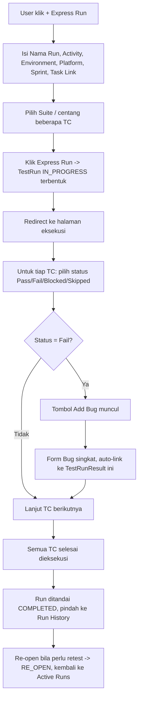
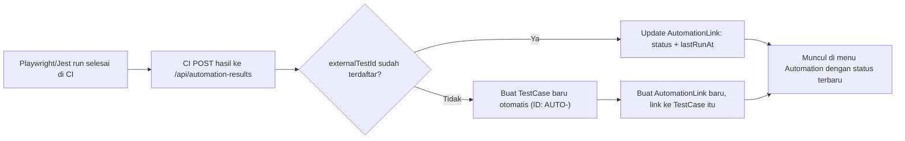

# PRD: Soul Testcase Management
**SoulParking QA Team**
Status: Draft v0.4 — disinkronkan dengan kondisi aplikasi per 13 September 2026

> **Changelog v0.3 → v0.4 (sinkronisasi dengan implementasi):**
> - Section 0: ditambah entitas **Section** (sub-grouping TC di dalam Suite)
> - Section 4: format **TC ID** diperbarui — lowercase, berprefix platform + prefix fitur (mis. `web-ovrtm-016`), menggantikan format path hierarki
> - Section 5: `Attachment` pindah ke **Cloudflare R2** (bukan Google Drive) dengan 3 konteks pemilik (TestCase / TestRunResult / Bug); `Bug` ditambah `resolvedAt` + `expectedResult`; `TestRun` ditambah `activityType`, `platforms`, `environment`, `sprint`, `taskLink`, `completedAt`; `Project` ditambah `platform` (enum) + `docUrl`; `User` ditambah `passwordHash`
> - Section 6.2: ditambah **lifecycle status TestRun** (PENDING/IN_PROGRESS/COMPLETED/RE_OPEN) + halaman **Active Runs**, filter tanggal, dan aturan konsistensi **bug selesai → hasil FAIL otomatis PASS**
> - Section 6.5: dashboard & Reports diperluas (KPI cards, Testing Health, definisi metrik "Tested"), ditambah **Weekly Testing Report** (salin body email) dan **export PDF run report**
> - Section 6.6 / 7: auth berubah dari Google OAuth domain-restricted menjadi **Credentials (email + password, bcrypt)**; arsitektur render berubah ke **CSR** (client-side rendering) dengan route handler JSON
> - Section 9: poin 5 (Google Workspace) & 6 (internal vs hybrid) **Resolved**; ditambah pertanyaan baru (retensi R2, notifikasi)
> - Section 10: Step 1–7 ditandai **selesai**; Step 5 direvisi ke R2; ditambah Step 9 (Reports & Weekly Report)
> - Section 11 & 12: menu/navigasi dan flow disesuaikan dengan UI aktual
>
> **Changelog v0.1 → v0.3 (historis):**
> - Section 4: hierarki Modul/Submodul diganti model Folder rekursif (self-referencing tree), Platform & Project tetap sebagai anchor tetap
> - Section 5: entity `Module`/`Submodule` digabung jadi `Folder`; `AutomationLink` ditambah field `externalTestId` (unik) untuk mendukung upsert dari hasil CI; `TestRunResult` ditambah `titleSnapshot`
> - Section 6.1: CRUD hierarki disesuaikan ke Folder rekursif
> - Section 6.2: flow Test Run disederhanakan ala Qase (Express Run) — tidak ada entitas Test Plan terpisah untuk v1
> - Section 6.4: traceability requirement/PRD memakai global search (tsvector) + mention `@TC-ID`, bukan entitas `Requirement` baru
> - Section 9: poin 1, 2, 3 (definisi Platform, reusability, kedalaman hierarki) resolved — lihat catatan di section tersebut
> - Section 11: struktur menu/navigasi aplikasi
> - Step 1, 2, 3, 4, 6 di rencana pengerjaan: AI command disesuaikan ke skema baru
> - Section 1: revisi latar belakang — tool yang dipakai saat ini adalah ClickUp (bukan CSV/XLSX/docx), dengan pain point konkret ditambahkan (reuse TC tidak proper, coverage sulit dihitung)
> - Section 12: UI/UX & flow utama — layout kasar tiap layar kunci, flow diagram (Express Run, Automation upsert dari CI, Bug dari eksekusi), prinsip UI umum lintas layar
> - Section 0: terminologi — label dokumen/UI diubah ke gaya Qase (Project, Suite); `Platform` di-rename jadi `Project`, dan `Project`+`Folder` lama digabung jadi satu tabel `Suite` rekursif. Lihat Step 3.5 (Section 10) untuk migrasi data dari skema lama.

---

## 0. Terminologi

Struktur final (skema = label dokumen, tidak ada lagi perbedaan seperti draft sebelumnya):

- **Project** — top-level, representasi produk/aplikasi berbeda (Officer App, Web Admin, dst). Punya `platform` enum (WEB/MOBILE/HARDWARE/API) yang dipakai untuk prefix ID dan pengelompokan di sidebar. *(sebelumnya bernama teknis `Platform`)*
- **Suite** — rekursif (self-referencing), berada di dalam 1 Project, bisa nested tanpa batas kedalaman. *(sebelumnya 2 tabel terpisah: `Project` lama + `Folder`, sekarang digabung jadi 1 tabel `Suite`)*
- **Section** — sub-grouping **di dalam** Suite (satu level, tidak rekursif). Dipakai untuk memecah daftar TC yang panjang dalam satu Suite. Menghapus Section hanya melepas TC-nya (jadi "Tanpa Section"), tidak menghapus TC.
- **Test Case** — berada di dalam 1 Suite (opsional di dalam 1 Section). TC ID auto-generate, tetap bisa di-override manual.
- **Test Run** — sesi eksekusi (Express Run) berisi sekumpulan TC terpilih, dengan lifecycle status sendiri (lihat Section 6.2).

> Riwayat: draft v0.2 sempat mempertahankan 2 tabel teknis terpisah (`Project`+`Folder`) dengan alasan menghindari migrasi karena masih tahap MVP lokal. Begitu ada rencana pindah ke server kantor, penyatuan ini justru lebih murah dilakukan sekarang dibanding setelah Step 4+ (Test Run, Automation) menambah lebih banyak foreign key yang bergantung pada struktur lama. Penyatuan itu sudah dieksekusi (Step 3.5) dan aplikasi kini berjalan di struktur final.

## 1. Latar Belakang

QA team SoulParking saat ini mengelola test case menggunakan **ClickUp** untuk berbagai fitur produk (Officer App, Web Admin, dsb), dengan konvensi penamaan dan struktur (Module → Suite → Sub-suite) yang sudah cukup matang secara konsep, tapi ClickUp sendiri tidak didesain untuk kebutuhan test case management sehingga muncul beberapa kendala nyata:

- **Reuse TC tidak proper**: ClickUp tidak punya konsep "jalankan ulang TC yang sama di run/enhancement baru" secara native. Saat ini diakali dengan menambahkan TC yang sama ke *activity log* task terkait — bukan mekanisme yang didesain untuk ini, sehingga histori eksekusi jadi tidak terstruktur dan sulit ditelusuri lintas run.
- **Coverage sulit dihitung**: karena tidak ada struktur eksekusi yang konsisten (lihat poin di atas), menghitung persentase TC yang sudah tercakup automation maupun coverage per fitur jadi sulit dilakukan secara akurat dari data yang ada di ClickUp.

Automation testing (Playwright/Jest/TypeScript) juga berjalan terpisah dari dokumentasi manual TC di ClickUp, dan tidak ada koneksi eksplisit antara TC manual, automation script, dan bug findings.

## 2. Tujuan (Goals)

Membangun internal tool untuk test case management dengan tiga prioritas utama:

1. **Visibility** — status TC, hasil eksekusi, dan bug terkait harus mudah dilihat tanpa perlu buka banyak file/tools terpisah.
2. **Kemudahan penggunaan** — workflow membuat, mengorganisir, dan menjalankan TC harus lebih cepat dibanding proses manual saat ini.
3. **Koneksi/traceability antar entitas** — TC manual harus terhubung eksplisit dengan automation script dan bug findings, bukan disimpan sebagai data terpisah.

## 3. Target Pengguna

- **QA** — full access: create/edit/execute TC, kelola hierarki (Project/Suite/Section), kelola Bug, kelola user, review automation status.
- **Developer** — view TC & Bug, update status `AutomationLink`, update/resolve status Bug.
- **Product** — view-only dashboard/coverage; menu Settings & Automation disembunyikan.

Matriks akses konkret per menu ada di Section 11. Pembatasan ditegakkan di server (server action + route handler mengembalikan 401/403 JSON), bukan hanya di UI.

## 4. Struktur Hierarki

```
Project → Suite (nested, kedalaman bebas) → Section (opsional, 1 level) → Test Case
```

- **Project**: representasi produk/aplikasi berbeda (Officer App, Web Admin, Customer App, dst). Punya `platform` enum + `docUrl` (referensi dokumentasi). Dapat dibuat baru sesuai kebutuhan.
- **Suite**: berada di dalam 1 Project, bersifat **rekursif** (self-referencing — Suite bisa punya sub-Suite tanpa batas kedalaman). Kode unik per level Suite yang sama (siblings).
- **Section**: sub-grouping opsional di dalam satu Suite, **tidak rekursif**.
- **Test Case**: berada di dalam 1 Suite, opsional di dalam 1 Section.

### Format ID

- **Suite code**: `{platform}-{kode-suite}` — mis. suite `dash-ovrtm` di project berplatform WEB menjadi `web-dash-ovrtm`. Prefix platform diturunkan otomatis dari `Project.platform` (WEB→`web`, MOBILE→`mob`, HARDWARE→`hdw`, API→`api`, fallback `gen` bila platform null). Berlaku saat create & update, idempoten (code yang sudah berprefix tidak ditambah lagi).
- **TC ID**: `{platform}-{FeaturePrefix}-{NNN}` — mis. `web-ovrtm-016`. Prefix fitur diturunkan dari nama Suite/section (huruf awal tiap kata dipertahankan, vokal a/e/i/o dibuang, huruf duplikat di-skip; "Attendance" → `Atndc`, "Login Failed" → `LgnFld`). Penomoran restart per prefix. Tetap bisa di-override manual (di-lowercase otomatis).
- **Semua kode yang di-generate aplikasi bersifat lowercase.**
- Kode turunan lain: Bug → `bug-2026-xxxx`; Run → `sp{NN}-YYYYMMDD-{4}` (nomor sprint + tanggal UTC + 4 karakter campur dari id, fallback `spna` bila sprint kosong), mis. `sp03-20260901-k87h`.
- Pengecualian yang disengaja: TC ID dari webhook CI memakai format idempoten `AUTO-<externalTestId>` (tetap uppercase) agar upsert tidak menghasilkan TC duplikat.

> **Kenapa berubah dari fixed Modul/Submodul:** hierarki fixed-depth memaksa fitur yang butuh lebih dari 2 level (mis. filter modal dengan banyak section) untuk dipaksakan masuk level yang ada, atau butuh migrasi skema tiap kali ada kasus lebih dalam. Model rekursif (dipakai TestRail via nested Section, dan Qase via nested Suite) menghindari ini — kedalaman menyesuaikan kebutuhan tiap fitur tanpa perubahan skema.

## 5. Entity Relationship Diagram

Entitas utama: `User`, `Project`, `Suite` (rekursif), `Section`, `TestCase`, `TestRun`, `TestRunResult`, `AutomationLink`, `Bug`, `Attachment`, `ActivityLog`.

Poin desain penting:

- `Suite` self-referencing (`parentId` nullable) dan punya `projectId` (FK ke `Project`, `onDelete: Cascade`) — Suite level pertama (`parentId = null`) langsung anak dari Project. Constraint unik: `[projectId, parentId, code]`.
- `Section` milik satu `Suite` (`onDelete: Cascade`). Menghapus Section meng-`SetNull` `TestCase.sectionId` — TC tidak ikut terhapus.
- `TestCase` punya `suiteId` (nullable, `onDelete: Cascade` — hapus Suite ikut menghapus TC-nya, sesuai peringatan UI) dan `sectionId` (nullable). Field: tcId, title, scenario, precondition, steps, testData, expectedResult, priority (LOW/MEDIUM/HIGH/CRITICAL), status (DRAFT/ACTIVE/DEPRECATED), order.
- `TestRun`: id, name, projectId, `status` (RunStatus), activityType, `platforms` (CSV), `environment` (DEV/STG/PRE-PROD/PROD), `sprint`, `taskLink`, createdAt, updatedAt, `completedAt` (di-null-kan lagi bila run keluar dari COMPLETED).
- `TestRunResult`: runId, testCaseId, `titleSnapshot` (salinan title TC saat Run dibuat — histori tetap akurat meski title master diedit), `status` (PASS/FAIL/BLOCKED/SKIPPED/**NOT_RUN** default), actualResult, notes, updatedById/updatedAt. Unik `[runId, testCaseId]`.
- `AutomationLink` 1-ke-1 dengan TestCase (`testCaseId` unik), menyimpan `externalTestId` (unik), status otomasi, path file script, hasil run CI terakhir (`lastRunAt`, `lastResult`). Dipakai untuk upsert dari hasil CI: `externalTestId` belum ada → TestCase + link dibuat otomatis; sudah ada → status di-update.
- `Bug`: title, description, `expectedResult` (opsional, ditambahkan agar QA bisa mencatat ekspektasi saat create bug dari modal), status (OPEN/IN_PROGRESS/RESOLVED/CLOSED), severity, `externalLink` (referensi Jira/GitHub — lihat Section 9 poin 6), `testCaseId` (nullable), `testRunResultId` (nullable), `resolvedAt` (nullable, di-set otomatis saat status → RESOLVED/CLOSED dan di-null-kan saat dibuka lagi). **Tidak ada** kolom `source` (INTERNAL vs JIRA) — model hybrid ringan dipilih secara sadar (Section 9 poin 6).
- `Attachment` menyimpan metadata saja (fileName, mimeType, size, storageKey unik) — byte disimpan di **Cloudflare R2**. Terhubung ke **tepat satu** dari tiga konteks: `testCaseId` (reference), `testRunResultId` (evidence), atau `bugId` (evidence bug). Invariant "tepat satu pemilik" dijaga oleh CHECK constraint di level DB (migration `202609100002_add_attachment`).
- `ActivityLog`: testCaseId, action (CREATED/UPDATED/DELETED/STATUS_CHANGED/EXECUTED/COMMENTED), detail, userId, createdAt — audit per TestCase.
- `User`: email unik, name, image, role (QA/DEVELOPER/PRODUCT, default DEVELOPER), `passwordHash` (nullable, bcrypt) untuk login Credentials.
- Tidak ada entitas `TestPlan` terpisah di v1 — `TestRun` dibuat langsung dari pemilihan Suite/TestCase individual (Section 6.2).
- Tidak ada entitas `Requirement` terpisah — traceability ke PRD/acceptance criteria memakai global search + mention `@TC-ID` (Section 6.4).

## 6. Fitur

### 6.1 Test Case Management (Core)

- CRUD Project / Suite (nested, drag-drop reorder dan drag-drop reparent antar Suite)
- CRUD **Section** di dalam Suite (create/rename/delete) sebagai sub-grouping TC
- CRUD Test Case dengan field: Title, Detail Skenario, Precondition, Steps, Test Data, Expected Result, Priority, Status
- TC ID auto-generate berprefix platform + prefix fitur, dengan opsi override manual (lihat Section 4)
- Import/export CSV & XLSX (kompatibel dengan format kerja QA saat ini)
- Halaman detail TC dengan tab: **Detail, Automation, Run History, Bugs, Attachments** — single source of truth per TC. Tab "Edit" mengarah ke modal yang sudah ada di halaman Suite (deep-link `?edit=<tcId>`), bukan modal edit terpisah.

### 6.2 Test Execution & Tracking

**Lifecycle status TestRun** (`RunStatus`):

- `PENDING` — run sudah dibuat, testing belum dimulai
- `IN_PROGRESS` — sedang dieksekusi
- `COMPLETED` — selesai (punya `completedAt`)
- `RE_OPEN` — pernah COMPLETED, dibuka lagi untuk retest/regresi (tetap dihitung "punya bukti eksekusi" agar coverage tidak turun palsu)

"Belum selesai" (tampil di halaman **Active Runs**) = `PENDING | IN_PROGRESS | RE_OPEN`.

- **Express Run**: form berisi Nama Run, Tipe Activity (Enhancement / UI/UX Refinement / Iteration / Refactor / Bug Fix / Regression), Environment (DEV/STG/PRE-PROD/PROD), Platform (multi-pilih), Sprint, Task Link (opsional), lalu pemilihan Suite/Test Case individual dari Repository. Klik "Express Run" → Test Run terbentuk seketika dan diarahkan ke halaman eksekusi.
- Halaman **Active Runs**: daftar run yang belum selesai, dikelompokkan per status (IN_PROGRESS → RE_OPEN → PENDING), dengan search (Run ID/nama), filter (Platform, Projects, rentang bulan `from`/`to`), dan pagination — parity dengan Run History.
- Halaman **Run History**: daftar run COMPLETED, dengan search, filter, dan pagination yang sama.
- Update status eksekusi per TC dalam suatu Run (Pass/Fail/Blocked/Skipped) + actual result & notes. Hanya run dengan status aktif (IN_PROGRESS/RE_OPEN) yang menerima hasil eksekusi.
- `titleSnapshot` disimpan otomatis saat Run dibuat.
- Histori eksekusi per TC lintas Run (query dari `TestRunResult` berdasarkan `testCaseId`).
- **Run report**: halaman print (SSR, `/test-runs/[id]/report`) dengan aksi Kembali, **Download PDF** (jsPDF + html2canvas, multi-halaman A4), dan **Print**.
- **Aturan konsistensi bug ↔ hasil eksekusi**: saat bug yang tertaut ke sebuah `TestRunResult` diselesaikan (status → RESOLVED/CLOSED), hasil eksekusi FAIL yang tertaut **otomatis diubah menjadi PASS** — defect yang sudah diperbaiki berarti TC-nya kini lolos. Diterapkan atomik dalam `$transaction` yang sama, dan hanya bila hasilnya masih FAIL (hasil yang sudah PASS / tidak tertaut tidak disentuh). Membuka ulang bug (OPEN/IN_PROGRESS) mengosongkan `resolvedAt` tetapi **tidak** mengembalikan hasil eksekusi ke FAIL.
- *(Fase lanjutan, di luar scope v1)*: Test Plan sebagai grouping multi-Run untuk regression cycle terjadwal/multi-config.

### 6.3 Attachment (Reference & Evidence)

- Upload foto/video sebagai reference di level TC, evidence di level hasil eksekusi (TestRunResult), atau evidence langsung di Bug
- **Storage via Cloudflare R2** (S3-compatible), diakses lewat presigned URL: upload langsung dari client ke R2, backend hanya menyimpan metadata; URL GET presigned berlaku ~1 jam
- Batas ukuran file **100 MB** per attachment; MIME yang diterima: `image/*` dan `video/*`
- Konstanta batas & validasi MIME dipisah dari modul R2 agar aman dipakai di client (`lib/storage/limits.ts`)
- Invariant "tepat satu pemilik" (TestCase / TestRunResult / Bug) dijaga di level DB

> **Deviasi dari rencana awal:** PRD v0.3 menetapkan Google Drive (Shared Drive) sebagai storage, tapi setup-nya butuh provisioning manual dari admin IT (Service Account + Shared Drive) yang menghambat. R2 dipilih karena self-serve; lihat Section 9 poin 5.

### 6.4 Koneksi & Traceability

- Link TC manual ↔ automation script: via `AutomationLink.externalTestId`, mendukung **auto-create TestCase** saat hasil eksekusi otomatis (CI) di-push ke endpoint dan `externalTestId`-nya belum terdaftar
- Endpoint **`POST /api/automation-results`** menerima `{ externalTestId, status (PASS|FAIL), scriptPath, title?, suiteId?, timestamp }` dari CI Playwright/Jest dan melakukan upsert
- Link TC / hasil eksekusi ↔ Bug (internal atau referensi ke Jira/GitHub Issues via `externalLink`)
- Halaman detail TC dengan tab Detail/Automation/Run History/Bugs/Attachments
- Global search lintas entitas (TC, Bug, automation file) — di v1 berupa pencarian per-halaman (search bar di list), bukan tsvector lintas entitas
- Mention/referensi `@TC-ID` saat menulis deskripsi bug

### 6.5 Reporting & Dashboard

**Dashboard** (`/`):

- Filter global: Platform, Module (Suite), Environment, Periode (Semua Waktu / 7 Hari / 30 Hari / Bulan Ini)
- **Testing Health** banner: `HEALTHY` / `ATTENTION_NEEDED` / `CRITICAL` / `NO_DATA`, dihitung dari pass rate, jumlah FAIL, bug Critical/High, dan coverage. Ambang batas terpusat di konstanta (`HEALTH_THRESHOLDS`).
- 6 KPI card: **Total Test Cases**, **Test Coverage**, **Pass Rate**, **Failed Tests**, **Open Bugs** (dengan jumlah Critical/High), **Automation Coverage**
- **Execution Summary** (distribusi PASS/FAIL/BLOCKED/SKIPPED/NOT_RUN)
- **Action Required** (run dengan failure, bug siap retest, TC yang belum dieksekusi)
- **Coverage by Suite**, **Recent Runs**, **Recent Bugs**

**Definisi metrik (dibekukan agar tidak menyesatkan):**

- "Executed" = hasil run dengan status ≠ `NOT_RUN`
- "Tested" (dasar **Test Coverage**) = TC **unik** yang punya hasil executed pada run yang sudah tuntas (`COMPLETED` atau `RE_OPEN`) — eksekusi berulang tidak dihitung dobel, run in-progress/aborted tidak mengotori angka
- Persentase hanya ditampilkan bila penyebut > 0; selain itu "—" (bukan 0%)
- Konvensi ini terpusat di `lib/qa-metrics.ts`

**Reports** (`/reports`):

- Filter Platform & Project
- **Weekly Testing Report** — tombol untuk merangkum semua task testing yang sedang berjalan + yang baru selesai dalam periode, menghasilkan **subject + body email siap kirim** yang bisa disalin ke clipboard (bukan draft `mailto:`, bukan integrasi SMTP). Dipakai untuk laporan rutin tiap Jumat ke CTO/PM/EM.
- **Inventory Summary** (total TC, TC in-suite vs orphan, jumlah Suite, jumlah Project, TC untested + persentasenya)
- **Priority Composition** & **Status Composition**
- **Coverage Gap Table** (per Suite: total, tested, untested)
- **Repository Hygiene** (Suite tanpa TC, TC orphan, cakupan automation)

> Section "QA Trend" (tren bug resolved per minggu) **ditunda** karena belum ada data eksekusi historis yang cukup untuk menjadi sumbernya. Prasyaratnya sudah disiapkan: `Bug.resolvedAt` terisi otomatis saat bug selesai.

### 6.6 Kolaborasi & Governance

- Role: QA, Developer, Product (lihat Section 3 & 11 untuk detail akses)
- Auth via **NextAuth.js Credentials Provider** (email + password, verifikasi bcrypt terhadap `User.passwordHash`), session strategy JWT. User tanpa `passwordHash` belum bisa login sampai QA/admin men-set password-nya.
- Halaman **Settings** (QA only): tab **Projects** (kelola Project/Suite) dan tab **User & Roles** (kelola user + role, set password)
- Activity log per TC (siapa mengubah apa, kapan)
- Review/approval workflow untuk TC baru *(opsional, fase lanjutan — lihat Section 9 poin 7)*

## 7. Tech Stack

| Layer | Pilihan |
|---|---|
| Framework | Next.js 14 (App Router, TypeScript) — **CSR** untuk halaman `(app)`, SSR hanya untuk halaman print |
| Database | PostgreSQL (Supabase) |
| ORM | Prisma 7 (`@prisma/adapter-pg`) |
| Hosting | Vercel |
| Auth | NextAuth.js v4 — Credentials (email + password, bcrypt), JWT session |
| Attachment storage | Cloudflare R2 (S3-compatible) via presigned URL |
| PDF export | jsPDF + html2canvas (client-side) |

**Catatan arsitektur penting:**

- **Client-Side Rendering**: seluruh halaman di grup `(app)` adalah thin client shell yang mengambil data setelah mount lewat route handler JSON (`/api/me`, `/api/projects`, `/api/dashboard`, `/api/bugs`, `/api/automation`, `/api/reports`, `/api/reports/weekly`, `/api/settings`, `/api/suites/[id]`, `/api/test-cases/[id]`, `/api/test-runs`, `/api/test-runs/history`, `/api/test-runs/options`, `/api/test-runs/[id]`, …). Route handler memuat logika query + agregasi; **mutasi tetap server action**. 401/403/404 dikembalikan sebagai status JSON dan dirender sebagai blok error di client.
- **Pengecualian SSR**: hanya `(print)/test-runs/[id]/report` yang tetap server-rendered agar output print/PDF stabil tanpa fetch flash.
- **Refresh setelah mutasi**: tidak memakai `router.refresh()`; komponen menyimpan mirror data lokal dan mem-patch hasil mutasi di tempat (server action mengembalikan record hasil, bukan sekadar `{ success }`). Ini mencegah tabel/kartu berkedip ke skeleton.
- Vercel membatasi ukuran request body (~4.5 MB) dan waktu eksekusi function → upload file **harus** langsung dari client ke R2 lewat presigned PUT, backend hanya menyimpan metadata. (Aplikasi menetapkan batas 100 MB per file, jauh di atas limit body Vercel, sehingga upload langsung-client wajib.)
- Supabase free tier (500 MB database) diperkirakan cukup karena attachment tidak disimpan di database. Perlu diantisipasi: project auto-pause setelah ~1 minggu tanpa aktivitas.
- Model Suite rekursif dan alur Express Run dipilih (dibanding meniru penuh TestRail dengan Test Plan berlapis) karena lebih ringan dan lebih cocok dengan limit function timeout Vercel.

## 8. Out of Scope (Fase Awal)

- Integrasi otomatis dua arah dengan Jira (cukup simpan link/reference manual)
- Notifikasi real-time (email/Slack)
- Mobile app khusus (web-responsive dulu)
- Entitas Test Plan terpisah (grouping multi-Run) — v1 cukup Express Run per Suite/TC
- Entitas Requirement terpisah — traceability ke PRD cukup lewat search + mention
- Google OAuth domain-restricted (digantikan Credentials; lihat Section 9 poin 5)
- QA Trend / tren historis di Reports (ditunda sampai ada data eksekusi historis)

## 9. Yang Masih Perlu Didefinisikan

1. ~~Definisi "Project" secara presisi~~ — **Resolved**: Project = produk/aplikasi berbeda (Officer App, Web Admin, Customer App), bukan environment/device.
2. ~~Reusability Suite lintas Project~~ — **Resolved**: tidak diperlukan, karena Project dianggap dunia/struktur Suite yang independen.
3. ~~Kedalaman hierarki~~ — **Resolved**: diganti model Suite rekursif (Section 4).
4. **Reusable Test Data** — Apakah Test Data tetap sebagai free text per TC, atau dipisah jadi entity `TestDataBlock` reusable yang bisa dipakai lintas TC? *(masih terbuka)*
5. ~~Konfirmasi Google Workspace~~ — **Resolved (arah berubah)**: rencana Google Drive API + Shared Drive dibatalkan karena butuh provisioning manual dari admin IT (Service Account, Shared Drive, invite). Diganti **Cloudflare R2** yang self-serve. Konsekuensi: setup CORS bucket R2 wajib diset agar browser bisa upload (lihat `.env.example`), dan retensi/kuota kini di sisi R2 (poin 9).
6. ~~Bug tracking — internal penuh atau hybrid?~~ — **Resolved: hybrid ringan**. Bug dicatat penuh di dalam tool (title, description, expectedResult, severity, status, relasi ke TestCase/TestRunResult) + `externalLink` opsional untuk referensi keluar (Jira/GitHub). **Tidak** menambah kolom `source` (INTERNAL vs JIRA) — memformalkan model ringan yang sudah berjalan.
7. **Approval/review workflow** — Apakah TC baru butuh approval dari QA sebelum berstatus "Active", atau semua QA punya akses langsung publish? *(masih terbuka)*
8. **Notification & reminder** — Di luar scope fase awal: reminder untuk TC yang lama tidak di-run, atau automation flaky berturut-turut. *(belum)*
9. **Retensi attachment** — Berapa lama evidence (foto/video) disimpan di R2 sebelum di-archive/dihapus? Relevan untuk kontrol biaya/kuota R2. *(masih terbuka)*
10. **Definisi role secara detail** — Batasan akses konkret: siapa yang bisa hapus TC, ubah struktur Project/Suite, atau approve TC baru. Role dasar (QA/Developer/Product) sudah diputuskan & diimplementasi (Section 11), ini tinggal detail permission per aksi di luar yang sudah ada. *(sebagian)*
11. **QA Trend / tren historis** — Sumber data untuk tren (mis. bug resolved per minggu) belum memadai. `resolvedAt` sudah mulai terisi; perlu ditinjau ulang setelah beberapa bulan data terkumpul. *(ditunda)*

## 10. Rencana Pengerjaan Bertahap

Dipecah jadi beberapa step, urutan mengikuti dependency (fondasi dulu, baru fitur yang butuh fondasi itu). Status per v0.4: **Step 0–9 selesai**; Step 10 (hardening & onboarding) berjalan.

> **Catatan:** Step 1–3 di bawah adalah rencana ASLI (skema lama: `Platform`/`Project`/`Folder` terpisah) — sudah diimplementasikan, lalu dimigrasikan ke struktur final di Step 3.5.

### Step 0 — Project Setup & Scaffolding ✅
- Init Next.js + TypeScript project
- Setup Prisma + koneksi ke Supabase/Neon (database kosong)
- Setup ESLint/Prettier
- Setup repo di GitHub, connect ke Vercel (auto-deploy dari branch main)
- Deploy "hello world" untuk validasi pipeline CI/CD jalan

### Step 1 — Skema Database Inti (Hierarki + Auth) ✅ *(sudah dikerjakan — skema lama)*
- Model Platform, Project, Folder (rekursif), User
- Migration pertama
- Setup NextAuth.js + auth

### Step 2 — CRUD Hierarki (Platform/Project/Folder) ✅ *(sudah dikerjakan — skema lama)*
- API routes CRUD untuk Platform/Project/Folder (termasuk reparent)
- UI tree view rekursif dengan create/edit/delete di kedalaman berapa pun
- Drag-drop reorder antar sibling, drag-drop reparent

### Step 3 — Test Case CRUD ✅
- Model `TestCase` + migration
- Form create/edit TC (semua field di Section 6.1)
- TC ID auto-generate, dengan override manual
- Import/export CSV & XLSX

### Step 3.5 — Migrasi Skema ke Struktur Unified (Project/Suite) ✅
- Rename model `Platform` → `Project`
- Buat model `Suite` rekursif + `projectId`
- Migrasi data: Project lama → Suite `parentId = null`; Folder lama → Suite dengan parent mapping
- Update FK `TestCase.folderId` → `TestCase.suiteId`
- Hapus tabel lama, update API routes & UI

### Step 4 — Test Execution & Run Tracking (Express Run) ✅
- Model `TestRun` + `TestRunResult` dengan `titleSnapshot`
- Flow Express Run (pilih Suite/TC → run terbentuk)
- Halaman eksekusi: status per TC (Pass/Fail/Blocked/Skipped) + actual result
- Histori eksekusi per TC lintas Run

### Step 4.5 — Lifecycle Run & Active Runs ✅
- Enum `RunStatus` (PENDING/IN_PROGRESS/COMPLETED/RE_OPEN) + `completedAt` yang konsisten
- Halaman **Active Runs** (grouping per status) dan **Run History**, dengan search/filter/pagination parity
- Field run: activityType, platforms, environment, sprint, taskLink

### Step 5 — Attachment (revisi: R2, bukan Google Drive) ✅
- Model `Attachment` dengan CHECK constraint "tepat satu pemilik" (TestCase / TestRunResult / Bug)
- Presigned upload langsung dari client ke Cloudflare R2; backend simpan metadata
- Batas 100 MB, MIME `image/*` + `video/*`
- UI attach file di level TC, hasil eksekusi, dan Bug

### Step 6 — Automation Link & Bug Tracking ✅
- Model `AutomationLink` (`externalTestId` unik) + `Bug`
- Endpoint `POST /api/automation-results` untuk upsert dari CI + auto-create TestCase
- Halaman **Automation** (coverage per project, status Failing/Stale/Unstable, bulk link/unlink, panduan integrasi CI)
- Halaman **Bugs** + tab Automation/Bugs di detail TC
- Aturan bug selesai → hasil FAIL otomatis PASS; `Bug.resolvedAt` + `expectedResult`

### Step 7 — Dashboard, Search & Traceability ✅
- Dashboard: KPI cards, Testing Health, Execution Summary, Action Required, Coverage by Suite, Recent Runs/Bugs
- Filter global (Platform/Module/Environment/Periode)
- Definisi metrik terpusat di `lib/qa-metrics.ts`
- Pencarian per-halaman di list (TC/Bug/Automation)

### Step 8 — Role Permission, Menu & Polish ✅
- Navigasi utama sesuai Section 11 (sidebar, accordion Test Runs & Projects)
- Role-based access (QA/Developer/Product) di server action + route handler
- Activity log per TC
- Ganti auth ke Credentials (email + password)

### Step 9 — Reports, Weekly Report & PDF Export ✅
- Halaman **Reports**: Inventory Summary, Priority/Status Composition, Coverage Gap, Repository Hygiene
- **Weekly Testing Report**: generate subject + body email, preview modal, salin ke clipboard
- **Export PDF** run report (jsPDF + html2canvas) + halaman print SSR

### Step 10 — Hardening & Onboarding (berjalan)
- QA Trend (tren historis) — ditunda sampai data cukup
- Retensi attachment R2, notification/reminder, approval workflow TC (Section 9)
- Dokumentasi onboarding tim QA (lihat `docs/ONBOARDING.md`)

## 11. Struktur Menu / Navigasi

Sidebar (accordion; Test Runs & Projects punya submenu):

```
Dashboard
Reports
Bugs
Automation
Test Runs  ▸ Active Run | Run History
Projects   ▸ (dikelompokkan per platform: WEB / MOBILE / HARDWARE / API)
Settings
```

| Menu | Isi | Akses QA | Akses Developer | Akses Product |
|---|---|---|---|---|
| Dashboard | Testing Health, KPI (Total TC, Test Coverage, Pass Rate, Failed, Open Bugs, Automation Coverage), Action Required, Coverage by Suite, Recent Runs/Bugs | Full | View | View |
| Reports | Inventory Summary, Priority/Status Composition, Coverage Gap, Repository Hygiene, Weekly Testing Report | Full | View | View |
| Bugs | List Bug, update status, severity, external link, evidence attachment | Full CRUD | Update status | View |
| Automation | Coverage per project, status Automated/Failing/Stale/Unstable, bulk link/unlink, panduan CI | Full | Update status | — (disembunyikan) |
| Test Runs | Active Runs (grouping per status), Run History, Create Express Run, halaman eksekusi, run report/PDF | Create/execute/delete | View | View |
| Projects | Tree Project → Suite → TC (+ Section), detail TC (tab Detail/Automation/Run History/Bugs/Attachments) | Full CRUD | View | View |
| Settings | Tab Projects (kelola Project/Suite), tab User & Roles | Full | — (disembunyikan) | — (disembunyikan) |

Catatan role:

- Developer: tidak melihat menu Settings; di halaman Automation hanya bisa mengubah status (tanpa bulk link/edit/unlink); bisa update status Bug.
- Product: hanya melihat Dashboard, Reports, Bugs, Test Runs, Projects; menu Settings & Automation disembunyikan (bukan disabled).
- Penegakan di server: server action memakai `requireRole` (QA / DEVELOPER), route handler mengembalikan 401/403 JSON.

## 12. UI/UX & Flow Utama

Bagian ini menjelaskan alur interaksi per fitur kunci — bukan mockup visual detail, tapi urutan langkah dan layout kasar tiap layar, supaya jelas komponen apa yang perlu dibangun dan bagaimana mereka terhubung.

### 12.1 Layar Repository (Projects)

**Layout:**
- Sidebar kiri: tree Project → Suite (collapsible, rekursif), dengan tombol "+" di tiap level untuk tambah child
- Panel kanan: daftar Test Case di Suite yang sedang dipilih (table: TC ID, Title, Priority, Status, Automation status), dikelompokkan per **Section**
- Klik satu Test Case → buka halaman detail dengan 5 tab: Detail, Automation, Run History, Bugs, Attachments

**Flow bikin Test Case baru:**
1. User pilih/klik Suite di sidebar kiri
2. Klik tombol "New Test Case" di panel kanan
3. Form muncul: Title, Detail Skenario, Precondition, Steps, Test Data, Expected Result, Priority (+ Section opsional)
4. TC ID otomatis ter-preview (berprefix platform + fitur, bisa di-override) 
5. Simpan → TC muncul di list **seketika** (list di-patch dari hasil server action, tanpa reload halaman)

### 12.2 Layar Test Runs (Express Run)



**Catatan UI:** halaman eksekusi menampilkan satu TC per baris/card dengan tombol status besar (bukan dropdown) supaya cepat diklik saat testing manual berjalan cepat — prioritas "kemudahan penggunaan" di Section 2. Perubahan status satu TC **tidak boleh** me-refresh seluruh halaman (mirror data lokal di-patch di tempat). Run report tersedia via halaman print dengan tombol Download PDF & Print.

### 12.3 Layar Active Runs & Run History

- **Active Runs**: run belum selesai, di-accordion per status (IN_PROGRESS → RE_OPEN → PENDING — problem-first). Kolom: Run ID, Nama Run, Projects Covered, Suites Included, Sprint, Status, Pass Rate, Dibuat Oleh, Tanggal, Aksi.
- **Run History**: run COMPLETED, dengan search (Run ID/nama), filter (Platform, Projects, rentang bulan), dan pagination. Kedua halaman memakai komponen kontrol/filter yang sama (parity).
- Ubah status run dari baris tabel langsung memindahkan barisnya antar grup (atau membuangnya dari halaman) tanpa reload.

### 12.4 Flow Automation Link (dari CI, bukan manual)



- Di halaman Automation, baris diurutkan problem-first: FAILING → STALE → UNSTABLE → Belum Automated → Automated.
- **Stale** = AutomationLink berstatus AUTOMATED tetapi `lastRunAt` lebih lama dari **30 hari** (threshold berupa konstanta yang mudah diubah).
- Summary card hanya dibuat untuk status yang **bisa dideteksi otomatis** (Automated, Failing, Stale, Belum Automated). `UNSTABLE` muncul sebagai nilai status di tabel & filter, tetapi belum punya summary card.
- Tersedia **group by Suite** agar drill-down tetap terlihat meski summary di atas di-roll-up per Project.
- Bulk link memakai pola `{TC_ID}` untuk external test id; bulk unlink tidak menghapus TestCase.

### 12.5 Flow Bug dari hasil eksekusi

1. Saat menandai TC "Fail" di halaman eksekusi Run, tombol "Add Bug" muncul
2. Klik → form singkat: judul (default terisi dari title TC), deskripsi, expected result, severity, opsional link eksternal (hybrid — lihat Section 9 poin 6)
3. Simpan → Bug otomatis ter-link ke `TestRunResult` yang sedang dieksekusi (bukan cuma ke TestCase)
4. Bug juga muncul di tab "Bugs" pada halaman detail TestCase terkait
5. Saat Bug diselesaikan (RESOLVED/CLOSED), `TestRunResult` FAIL yang tertaut otomatis berubah menjadi PASS (lihat Section 6.2)

### 12.6 Layar Reports & Weekly Report

- Filter Platform & Project di kanan atas; seluruh section dihitung ulang mengikuti filter.
- Tombol **Weekly Testing Report** membuka modal berisi Subject + Body email; tombol "Copy Body" menyalin ke clipboard (textarea readOnly sebagai fallback bila clipboard diblokir browser).
- Kartu komposisi (Priority/Status) bersifat repository-wide; saat filter aktif diberi penanda "Seluruh repository" agar tidak disalahartikan.

### 12.7 Prinsip UI umum (berlaku di semua layar)

- **Mutasi tidak me-refresh seluruh halaman**: komponen client menyimpan mirror data lokal (dari respons server action) dan mem-patch di tempat; skeleton hanya muncul saat load awal, bukan setelah setiap aksi.
- Role Product tidak melihat tombol create/edit/delete sama sekali (bukan disabled — disembunyikan); menu Settings & Automation juga disembunyikan.
- Setiap perubahan status (TC Run, Bug, Automation) tercatat di Activity Log (Section 6.6).
- Tanggal dikirim antar layer sebagai ISO string dan diparse di client; halaman print/report tetap SSR agar output PDF stabil.
